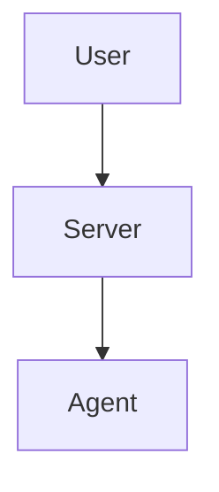

# GitHub Pages Setup Guide

This guide explains how to set up and deploy the KubeRDE documentation site using GitHub Pages.

## Quick Setup

### 1. Enable GitHub Pages

1. Go to your repository on GitHub
2. Navigate to **Settings** → **Pages**
3. Under **Source**, select:
   - **Source:** GitHub Actions
4. Click **Save**

That's it! The documentation will be automatically deployed when you push to the `main` branch.

### 2. Access Documentation Site

After the first deployment (2-3 minutes), your documentation will be available at:

```
https://xsoloking.github.io/kube-rde/
```

## Configuration

### Jekyll Configuration

The site is configured using Jekyll with the "Just the Docs" theme. Configuration is in `docs/_config.yml`.

**Key settings:**
- **title:** Site title
- **description:** Site description for SEO
- **theme:** just-the-docs
- **baseurl:** Automatically configured by GitHub Pages

### Theme: Just the Docs

We use the [Just the Docs](https://just-the-docs.github.io/just-the-docs/) theme, which is:
- Clean and professional
- Easy navigation with sidebar
- Built-in search
- Mobile responsive
- Dark mode support
- Markdown-based

**Features:**
- Automatic navigation from file structure
- Code syntax highlighting
- Mermaid diagram support
- Search functionality
- Responsive design

### Navigation Structure

Navigation is automatically generated from the file structure. Control with front matter:

```markdown
---
layout: default
title: Page Title
nav_order: 1
parent: Parent Page
---
```

**Example hierarchy:**
```
docs/
├── index.md (nav_order: 1)
├── guides/
│   └── INSTALLATION.md (parent: Guides, nav_order: 1)
├── tutorials/
│   └── 01-quick-start.md (parent: Tutorials, nav_order: 1)
└── reference/
    └── API.md (parent: Reference, nav_order: 1)
```

## Local Development

### Prerequisites

- Ruby 3.x
- Bundler

### Setup

```bash
# Navigate to docs directory
cd docs

# Install dependencies
bundle install

# Run local server
bundle exec jekyll serve

# With live reload
bundle exec jekyll serve --livereload
```

**Access locally:** http://localhost:4000

### Watch Mode

Jekyll automatically rebuilds when files change:

```bash
bundle exec jekyll serve --watch --livereload
```

## Customization

### Custom CSS

Add custom styles in `docs/assets/css/custom.scss`:

```scss
---
---

@import "{{ site.theme }}";

// Custom styles here
.custom-class {
  color: #3B82F6;
}
```

### Custom JavaScript

Add custom scripts in `docs/assets/js/custom.js`:

```javascript
// Custom JavaScript
console.log('KubeRDE Docs');
```

Include in pages:

```markdown
---
layout: default
title: Page Title
custom_js: custom
---
```

### Custom Layouts

Create custom layouts in `docs/_layouts/`:

```html
---
layout: default
---

<div class="custom-layout">
  {{ content }}
</div>
```

## Advanced Features

### Mermaid Diagrams

Include Mermaid diagrams directly in Markdown:

````markdown

````

### Code Highlighting

Syntax highlighting is automatic:

````markdown
```python
def hello():
    print("Hello, KubeRDE!")
```
````

Supported languages: Python, JavaScript, Go, YAML, JSON, Bash, and more.

### Search

Search is enabled by default and indexes:
- Page titles
- Headings (h2 by default)
- Page content

Configure in `_config.yml`:

```yaml
search_enabled: true
search:
  heading_level: 2
  previews: 3
```

### Collections

Organize content in collections (e.g., tutorials):

**_config.yml:**
```yaml
collections:
  tutorials:
    output: true
    permalink: /:collection/:name
```

**File location:**
```
docs/_tutorials/01-quick-start.md
```

### Navigation Tabs

Add top-level navigation tabs:

```yaml
aux_links:
  "GitHub":
    - "https://github.com/xsoloking/kube-rde"
  "Download":
    - "https://github.com/xsoloking/kube-rde/releases"
```

## Deployment

### Automatic Deployment

The `.github/workflows/docs.yml` workflow automatically:
1. Builds the site when changes are pushed to `main`
2. Deploys to GitHub Pages
3. Updates the live site (2-3 minutes)

### Manual Deployment

Trigger manual deployment:

1. Go to **Actions** tab
2. Select **Deploy Documentation** workflow
3. Click **Run workflow**
4. Select branch: `main`
5. Click **Run workflow**

### Build Status

Check build status:
- **Actions** tab → **Deploy Documentation**
- Badge: ``

## Troubleshooting

### Build Fails

**Check workflow logs:**
1. Go to **Actions** tab
2. Click on failed workflow run
3. View logs for errors

**Common issues:**
- **Ruby version mismatch:** Update Ruby in workflow
- **Gem conflicts:** Check Gemfile
- **Invalid YAML:** Validate front matter
- **Broken links:** Check relative links

### Page Not Found (404)

**Check:**
- File exists in `docs/` directory
- Front matter is correct
- Filename matches permalink
- Case sensitivity (use lowercase)

### Search Not Working

**Verify:**
- `search_enabled: true` in `_config.yml`
- JavaScript is enabled in browser
- No console errors
- Rebuild site

### Styling Issues

**Check:**
- Theme is installed: `bundle list | grep just-the-docs`
- Custom CSS syntax is valid
- Cache cleared in browser
- Inspect element in DevTools

## SEO and Analytics

### Search Engine Optimization

Configured via `jekyll-seo-tag` plugin:

```yaml
# _config.yml
title: KubeRDE Documentation
description: Comprehensive guide to KubeRDE
lang: en_US
twitter_username: kuberde
github_username: xsoloking
```

**Per-page SEO:**
```markdown
---
title: Page Title
description: Page description for search engines
image: /assets/images/og-image.png
---
```

### Google Analytics

Add in `_config.yml`:

```yaml
google_analytics: UA-XXXXXXXXX-X
# or for GA4
google_analytics: G-XXXXXXXXXX
```

### Sitemap

Automatically generated at `/sitemap.xml`.

### Robots.txt

Create `docs/robots.txt`:

```
User-agent: *
Sitemap: https://xsoloking.github.io/kube-rde/sitemap.xml
```

## Custom Domain

### Setup Custom Domain

1. **In your DNS provider:**
   ```
   Type: CNAME
   Name: docs
   Value: xsoloking.github.io
   ```

2. **In GitHub repository:**
   - Go to **Settings** → **Pages**
   - **Custom domain:** `docs.kuberde.com`
   - **Enforce HTTPS:** ✅ (recommended)

3. **Update `_config.yml`:**
   ```yaml
   url: "https://docs.kuberde.com"
   ```

4. **Wait for DNS propagation** (up to 48 hours)

### Verify Custom Domain

```bash
# Check DNS
dig docs.kuberde.com

# Should point to xsoloking.github.io
```

## Best Practices

### Documentation Structure

```
docs/
├── index.md                 # Homepage
├── guides/                  # User guides
├── tutorials/               # Step-by-step tutorials
├── reference/               # API and CLI reference
├── blog/                    # Blog posts
├── assets/                  # Images, CSS, JS
│   ├── images/
│   ├── css/
│   └── js/
└── _includes/               # Reusable snippets
```

### Writing Guidelines

- **Clear titles:** Descriptive and keyword-rich
- **Front matter:** Always include title, description
- **Headings:** Use h2 for main sections (##)
- **Code blocks:** Always specify language
- **Images:** Include alt text
- **Links:** Use relative links for internal pages

### Performance

- **Optimize images:** Compress before committing
- **Minimize plugins:** Only use what you need
- **Cache assets:** Leverage browser caching
- **CDN:** GitHub Pages uses Fastly CDN

### Accessibility

- **Alt text:** For all images
- **Semantic HTML:** Use proper heading hierarchy
- **Keyboard navigation:** Test tab navigation
- **Color contrast:** Ensure sufficient contrast
- **Screen readers:** Test with screen readers

## Monitoring

### Page Views

Use Google Analytics to track:
- Page views
- User sessions
- Traffic sources
- Search queries

### Broken Links

Check periodically:

```bash
# Using linkchecker
linkchecker https://xsoloking.github.io/kube-rde/

# Using htmlproofer
bundle exec htmlproofer docs/_site
```

### Lighthouse Score

Test performance and accessibility:
1. Open site in Chrome
2. DevTools → Lighthouse
3. Run audit
4. Fix issues

Target scores:
- Performance: > 90
- Accessibility: 100
- Best Practices: 100
- SEO: 100

## Resources

- [GitHub Pages Documentation](https://docs.github.com/en/pages)
- [Jekyll Documentation](https://jekyllrb.com/docs/)
- [Just the Docs Theme](https://just-the-docs.github.io/just-the-docs/)
- [Markdown Guide](https://www.markdownguide.org/)
- [Mermaid Diagrams](https://mermaid.js.org/)

## Support

- **Issues:** [GitHub Issues](https://github.com/xsoloking/kube-rde/issues)
- **Discussions:** [GitHub Discussions](https://github.com/xsoloking/kube-rde/discussions)
- **Docs:** [GitHub Pages Docs](https://docs.github.com/en/pages)
