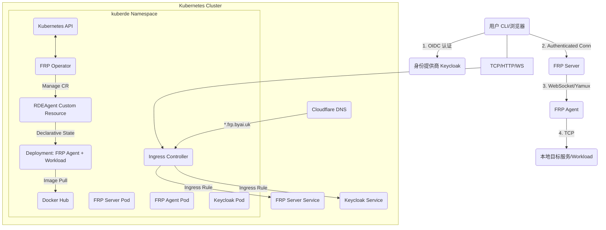

# KubeRDE Project - 设计文档

本文档概述了 KubeRDE 项目的主要设计决策和组件结构。

## 1. 整体架构

KubeRDE 旨在展示一个安全、可扩展的 Fast Reverse Proxy 系统，其核心思想是通过 Kubernetes Operator 管理代理 Agent，并结合 OIDC (OpenID Connect) 进行身份验证和授权。



## 2. 关键组件设计

### 2.1. FRP Server (`cmd/server`)

*   **技术栈**: Go, `gorilla/websocket`, `hashicorp/yamux`, `go-oidc/v3`, `net/http/httputil`.
*   **职责**:
    *   **流量入口**: 统一接收来自客户端 (CLI 或浏览器) 的连接。
    *   **OIDC Provider**: 初始化 OIDC 验证器，用于验证所有传入的 Access Token。
    *   **Yamux 会话管理**: 维护与每个 FRP Agent 之间的 Yamux 会话，提供多路复用能力。
    *   **SSH 隧道代理**: 处理来自 `kuberde-cli connect` 的 WebSocket 连接，将其与 Yamux Stream 进行双向数据拷贝。
    *   **HTTP 反向代理**:
        *   当请求 Host 为 `*.frp.byai.uk` (子域名) 时，Server 解析出 Agent ID。
        *   验证用户的 OIDC Cookie，确保用户有权访问该 Agent。
        *   通过 `httputil.ReverseProxy` 代理 HTTP 请求，其 `Transport` 实现了 `YamuxRoundTripper`，将 HTTP 请求通过 Agent 的 Yamux Stream 发送到目标 Workload。
    *   **OIDC Web 登录**: 提供 `/auth/login` 和 `/auth/callback` HTTP 端点，处理基于浏览器的 OIDC Authorization Code Flow，并在成功后设置 `frp_session` Cookie。
    *   **Agent 状态管理**: 记录 Agent 的在线状态和最后活跃时间，并提供 `/mgmt/agents/{id}` API 供 Operator 查询。
*   **授权策略**: 基于 OIDC Token 中的 `preferred_username` Claim 实现 Owner 绑定授权。只有当请求的 Agent ID (`user-{owner}-{name}`) 中的 Owner 与 Token 中的 `preferred_username` 匹配时，才允许访问。

### 2.2. FRP Agent (`cmd/agent`)

*   **技术栈**: Go, `gorilla/websocket`, `hashicorp/yamux`, `golang.org/x/oauth2/clientcredentials`.
*   **职责**:
    *   **内网客户端**: 运行在私有网络或 Kubernetes Pod 中，主动连接 FRP Server。
    *   **Client Credentials 认证**: 使用配置的 Client ID 和 Secret 向 Keycloak 获取 Access Token，用于认证与 FRP Server 的 WebSocket 连接。
    *   **Yamux 客户端**: 启动 Yamux 客户端会话，等待 Server 端打开 Stream。
    *   **本地目标转发**: 当 Server 打开一个新的 Yamux Stream 时，Agent 建立一个到 `LOCAL_TARGET` 的 TCP 连接，并将 Stream 与 TCP 连接之间进行双向数据拷贝。

### 2.3. FRP CLI (`cmd/cli`)

*   **技术栈**: Go, `spf13/cobra`, `go-oidc/v3`, `golang.org/x/oauth2`, `gorilla/websocket`.
*   **职责**:
    *   **命令行界面**: 提供 `login` 和 `connect` 子命令。
    *   **OIDC Code Flow**: `login` 命令通过启动本地 Web Server 并打开浏览器，实现 OIDC Authorization Code Flow，获取并保存用户的 Access Token 到 `~/.frp/token.json`。
    *   **SSH ProxyCommand**: `connect` 命令读取本地 Token，使用 WebSocket 连接 FRP Server，并充当 SSH 客户端的 `ProxyCommand`，实现 Stdin/Stdout 双向隧道。

### 2.4. FRP Operator (`cmd/operator`)

*   **技术栈**: Go, `k8s.io/client-go`, `k8s.io/apimachinery`.
*   **职责**:
    *   **CRD 管理**: 监听 `RDEAgent` Custom Resource 的变化。
    *   **Deployment 调和**: 根据 `RDEAgent` CR 的 `spec`，创建、更新或删除 Kubernetes Deployment。
    *   **Sidecar 注入**: 每个 Agent Deployment 都包含两个容器：`frp-agent` (Sidecar) 和 `workload` (用户指定的工作负载)。
    *   **SSH 配置注入**:
        *   强制 `workload` 容器的 `USER_NAME` 环境变量为 `RDEAgent.spec.owner`。
        *   将 `RDEAgent.spec.sshPublicKeys` 注入到 `workload` 容器的 `PUBLIC_KEY` 环境变量中。
        *   如果 `workload` 容器没有指定 `USER_PASSWORD`，Operator 会为其生成一个基于 `owner` 的默认密码 (`password-{owner}`)。
    *   **TTL 自动缩容**:
        *   Operator 包含一个后台 goroutine，每分钟轮询所有 `RDEAgent` CR。
        *   通过调用 FRP Server 的 `/mgmt/agents/{id}` API 获取 Agent 的最后活跃时间。
        *   如果 Agent 闲置时间超过 `spec.ttl`，Operator 会将对应的 Deployment 副本数缩减为 0。
    *   **资源配置**: 支持 `workload` 容器的镜像、命令、参数、环境变量配置。

### 2.5. 身份提供商 (Keycloak)

*   **角色**: OIDC (OpenID Connect) 兼容的身份提供商。
*   **部署**: 在 Kubernetes 集群中以 Deployment 方式部署，通过 Ingress 对外暴露。
*   **配置**: 预配置了 `frp` Realm，包含 `kuberde-cli` (Public Client) 和 `frp-agent` (Confidential Client / Service Account) 客户端，以及管理员和测试用户。

## 3. CRD 定义 (`RDEAgent` CRD `v1`)

```yaml
apiVersion: apiextensions.k8s.io/v1
kind: CustomResourceDefinition
metadata:
  name: rdeagents.kuberde.io
spec:
  group: kuberde.io
  versions:
    - name: v1
      served: true
      storage: true
      schema:
        openAPIV3Schema:
          type: object
          properties:
            spec:
              type: object
              properties:
                serverUrl:
                  type: string
                  description: "URL of the FRP Server"
                owner:
                  type: string
                  description: "Username of the owner (e.g., 'testuser'). If set, Agent ID will be 'user-{owner}-{name}'."
                authSecret:
                  type: string
                  description: "Name of the Secret containing AUTH_CLIENT_ID and AUTH_CLIENT_SECRET"
                workloadImage:
                  type: string
                  description: "Image for the user workload container"
                workloadCommand:
                  type: array
                  items:
                    type: string
                  description: "Command to run in the workload container."
                workloadArgs:
                  type: array
                  items:
                    type: string
                  description: "Arguments to the command in the workload container."
                localTarget:
                  type: string
                  description: "The local target address to expose (e.g., 'localhost:80', 'localhost:2222'). Defaults to 'localhost:80'."
                env:
                  type: array
                  items:
                    type: object
                    properties:
                      name:
                        type: string
                      value:
                        type: string
                sshPublicKeys:
                  type: array
                  items:
                    type: string
                  description: "List of SSH public keys to authorize for the user."
                resources:
                  type: object
                  x-kubernetes-preserve-unknown-fields: true
                  description: "Resource requirements for the workload container (CPU, Memory, GPU)"
                ttl:
                  type: string
                  description: "Idle timeout duration (e.g., '8h', '30m'). Set '0' to disable."
            status:
              type: object
              properties:
                active:
                  type: boolean
                lastActivity:
                  type: string
                  format: date-time
  scope: Namespaced
  names:
    plural: rdeagents
    singular: rdeagent
    kind: RDEAgent
    shortNames:
    - fa
```

---
