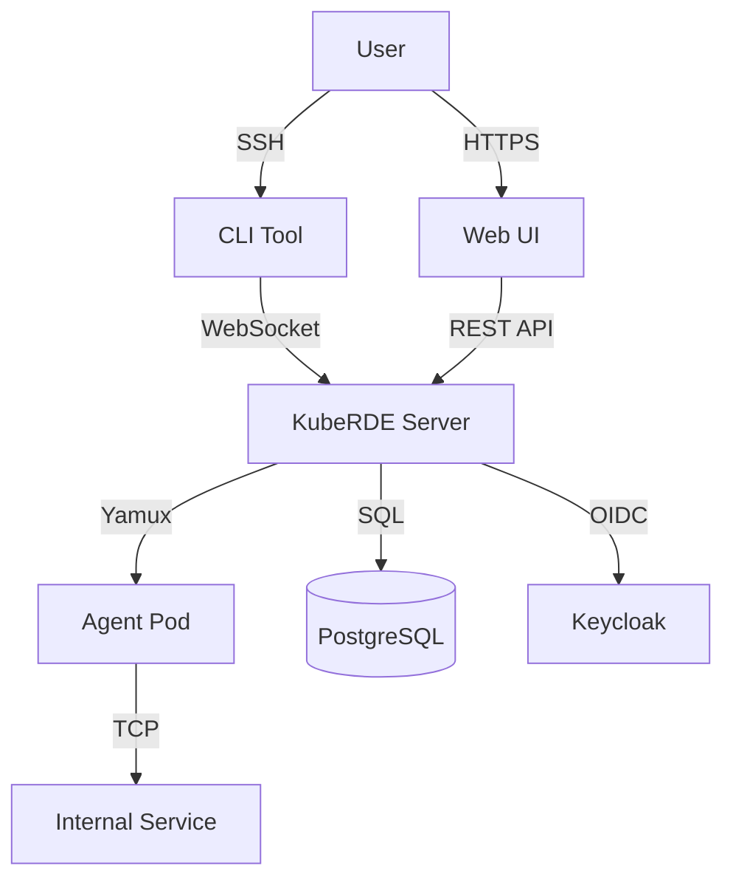
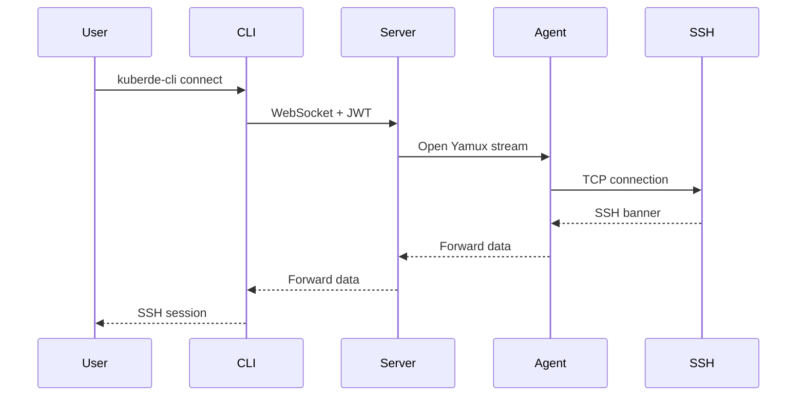
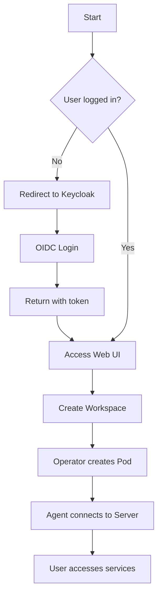
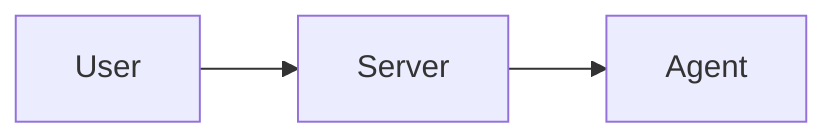

# Diagrams

Architecture and flow diagrams for KubeRDE documentation.

## Required Diagrams

### Architecture Diagrams
- [ ] `architecture-overview.png` - High-level system architecture
- [ ] `component-architecture.png` - Detailed component view
- [ ] `deployment-topology.png` - Kubernetes deployment topology
- [ ] `network-architecture.png` - Network flow and security boundaries

### Flow Diagrams
- [ ] `authentication-flow.png` - OIDC authentication sequence
- [ ] `agent-connection-flow.png` - Agent WebSocket connection flow
- [ ] `user-connection-flow.png` - User-to-agent connection flow
- [ ] `data-flow.png` - Complete data flow diagram
- [ ] `workspace-lifecycle.png` - Workspace creation and deletion flow

### Sequence Diagrams
- [ ] `login-sequence.png` - Login sequence with Keycloak
- [ ] `ssh-connection-sequence.png` - SSH connection establishment
- [ ] `websocket-handshake.png` - WebSocket and Yamux handshake
- [ ] `operator-reconciliation.png` - Operator reconciliation loop

### Entity Relationship
- [ ] `database-schema.png` - PostgreSQL database schema
- [ ] `data-model.png` - Logical data model

### Infrastructure
- [ ] `kubernetes-resources.png` - K8s resource hierarchy
- [ ] `operator-workflow.png` - Operator control flow
- [ ] `scaling-architecture.png` - Auto-scaling and load balancing

## Creating Diagrams

### Recommended Tools

**Online (Free):**
- **Draw.io / diagrams.net** - Best for architecture diagrams
  - URL: https://app.diagrams.net/
  - Export as PNG and SVG
  - Save source as `.drawio` file

- **Excalidraw** - Best for quick sketches
  - URL: https://excalidraw.com/
  - Export as PNG and SVG
  - Hand-drawn style

**Code-Based:**
- **Mermaid** - Best for sequence and flow diagrams
  - Integrates with GitHub markdown
  - Save as `.mmd` files
  - Generate PNG with `mmdc` CLI

- **PlantUML** - Best for UML diagrams
  - Text-based UML
  - Save as `.puml` files

**Desktop:**
- **Lucidchart** - Professional diagrams (paid)
- **OmniGraffle** - macOS diagramming tool (paid)
- **Microsoft Visio** - Windows diagramming (paid)

### File Formats

**Source Files (commit these):**
- `.drawio` - Draw.io source files
- `.mmd` - Mermaid diagram source
- `.puml` - PlantUML source

**Exported Files (for documentation):**
- `.svg` - Vector format (preferred for scalability)
- `.png` - Raster format (1920px width minimum)

### Specifications

- **Resolution:** 300 DPI for PNG, or use SVG
- **Width:** Minimum 1920px for PNG
- **Background:** Transparent or white
- **Colors:** Use consistent brand colors
- **Fonts:** Sans-serif, readable at all sizes
- **Style:** Clean, professional, consistent

## Diagram Templates

### Architecture Diagram Template (Draw.io)

```xml
<!-- Copy this XML to Draw.io to start with template -->
<mxGraphModel>
  <root>
    <mxCell id="0"/>
    <mxCell id="1" parent="0"/>
    <!-- Components go here -->
  </root>
</mxGraphModel>
```

### Mermaid Examples

#### Architecture Diagram


#### Sequence Diagram


#### Flow Diagram


## Color Scheme

Use consistent colors for components:

```
# KubeRDE Components
Server:     #3B82F6 (Blue)
Agent:      #10B981 (Green)
Web UI:     #8B5CF6 (Purple)
Operator:   #F59E0B (Amber)
CLI:        #06B6D4 (Cyan)

# Infrastructure
Kubernetes: #326CE5 (K8s Blue)
PostgreSQL: #336791 (PostgreSQL Blue)
Keycloak:   #4D4D4D (Gray)

# Connections
HTTPS:      #22C55E (Green)
WebSocket:  #3B82F6 (Blue)
gRPC:       #EF4444 (Red)
Database:   #8B5CF6 (Purple)
```

## Exporting from Draw.io

```bash
# Export to PNG (high resolution)
File > Export as > PNG
- Zoom: 300%
- Border Width: 10px
- Transparent Background: Yes

# Export to SVG
File > Export as > SVG
- Embed Images: Yes
- Include a copy of my diagram: Yes
```

## Generating PNG from Mermaid

```bash
# Install Mermaid CLI
npm install -g @mermaid-js/mermaid-cli

# Generate PNG from .mmd file
mmdc -i architecture.mmd -o architecture.png -w 1920 -H 1080

# Generate SVG
mmdc -i architecture.mmd -o architecture.svg
```

## Diagram Best Practices

### General Guidelines
- **Simplicity:** Don't overcrowd diagrams
- **Consistency:** Use same shapes for same concepts
- **Direction:** Top-to-bottom or left-to-right flows
- **Labels:** Clear, concise labels on all elements
- **Legend:** Include legend for complex diagrams
- **Spacing:** Adequate white space between elements

### Component Representation
- **Rectangles:** Services, applications
- **Cylinders:** Databases
- **Clouds:** External services, internet
- **Actors:** Users, external systems
- **Arrows:** Data flow, dependencies

### Annotations
- Use notes/callouts for important details
- Number steps in sequence diagrams
- Highlight critical paths with bold lines
- Use dotted lines for optional/async flows

## Version Control

Store both source and exported files:

```
diagrams/
├── architecture-overview.drawio      # Source
├── architecture-overview.png         # Export
├── architecture-overview.svg         # Export (vector)
├── authentication-flow.mmd           # Source
└── authentication-flow.png           # Export
```

## Usage in Documentation

```markdown
# Architecture diagram

*KubeRDE high-level architecture showing all major components*

# Mermaid diagram (rendered by GitHub)

\`\`\`

# SVG with link
[](./diagrams/architecture-overview.svg)
```

## Accessibility

- **Alt text:** Provide descriptive alt text for all diagrams
- **High contrast:** Ensure sufficient color contrast
- **Text descriptions:** Include text descriptions alongside complex diagrams
- **Scalable:** Prefer SVG for scalability

Example:
```markdown

```

## Resources

- [Draw.io Documentation](https://www.diagrams.net/doc/)
- [Mermaid Live Editor](https://mermaid.live/)
- [PlantUML Documentation](https://plantuml.com/)
- [C4 Model for Architecture](https://c4model.com/)
- [AWS Architecture Icons](https://aws.amazon.com/architecture/icons/)
- [Kubernetes Icons](https://github.com/kubernetes/community/tree/master/icons)
