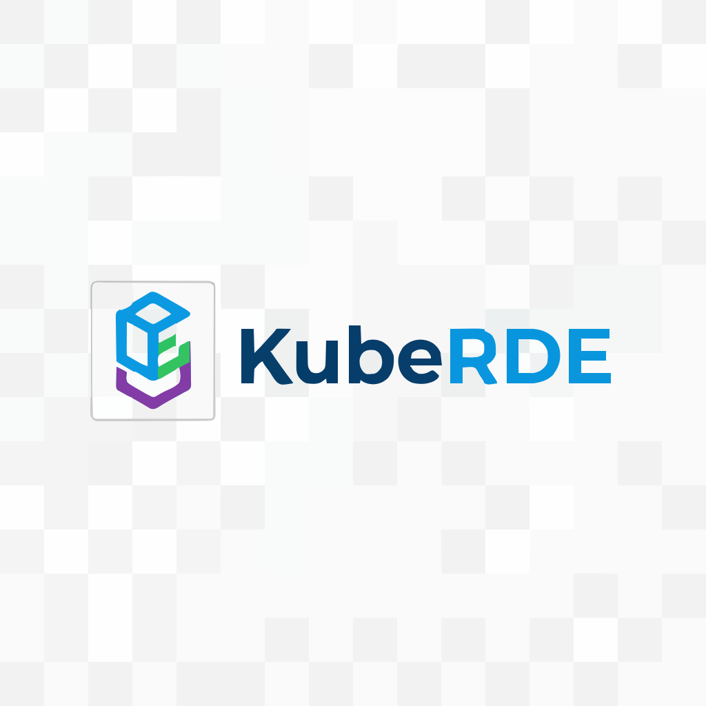

# Logos and Branding

KubeRDE logos and branding assets.

## Required Logo Files

### Main Logo
- [ ] `kuberde-logo.svg` - Full logo with icon and text (vector)
- [ ] `kuberde-logo.png` - Full logo (PNG, 1024px width)
- [ ] `kuberde-logo-dark.svg` - Dark mode version (vector)
- [ ] `kuberde-logo-dark.png` - Dark mode version (PNG)
- [ ] `kuberde-logo-light.svg` - Light mode version (vector)
- [ ] `kuberde-logo-light.png` - Light mode version (PNG)

### Icon Only
- [ ] `kuberde-icon.svg` - Icon only (vector, square)
- [ ] `kuberde-icon.png` - Icon only (512x512px)
- [ ] `kuberde-icon-16.png` - Favicon size (16x16px)
- [ ] `kuberde-icon-32.png` - Favicon size (32x32px)
- [ ] `kuberde-icon-64.png` - Small icon (64x64px)
- [ ] `kuberde-icon-128.png` - Medium icon (128x128px)
- [ ] `kuberde-icon-256.png` - Large icon (256x256px)

### Wordmark (Text Only)
- [ ] `kuberde-wordmark.svg` - Text logo (vector)
- [ ] `kuberde-wordmark.png` - Text logo (PNG)
- [ ] `kuberde-wordmark-dark.svg` - Dark background version
- [ ] `kuberde-wordmark-light.svg` - Light background version

### Social Media
- [ ] `social-preview.png` - GitHub social preview (1280x640px)
- [ ] `twitter-card.png` - Twitter card (1200x600px)
- [ ] `og-image.png` - Open Graph image (1200x630px)

## Logo Specifications

### Full Logo
- **Aspect ratio:** Maintain original aspect ratio
- **Minimum width:** 120px
- **File formats:** SVG (primary), PNG (fallback)
- **Background:** Transparent
- **Colors:** RGB for digital use

### Icon
- **Size:** Square (1:1 aspect ratio)
- **Minimum size:** 16x16px
- **Maximum size:** 1024x1024px
- **Format:** SVG and multiple PNG sizes
- **Background:** Transparent
- **Padding:** 10% margin inside square

### Wordmark
- **Format:** Horizontal layout preferred
- **Minimum width:** 100px
- **Legibility:** Clear at all sizes
- **Spacing:** Consistent letter spacing

## Brand Colors

```css
/* Primary Colors */
--kuberde-blue: #3B82F6;      /* Primary brand color */
--kuberde-dark: #1E3A8A;      /* Dark blue */
--kuberde-light: #DBEAFE;     /* Light blue */

/* Accent Colors */
--kuberde-green: #10B981;     /* Success, agent */
--kuberde-purple: #8B5CF6;    /* Web UI, secondary */
--kuberde-amber: #F59E0B;     /* Warning, operator */

/* Neutral Colors */
--kuberde-gray-50: #F9FAFB;
--kuberde-gray-100: #F3F4F6;
--kuberde-gray-500: #6B7280;
--kuberde-gray-900: #111827;
```

## Usage Guidelines

### Clear Space
Maintain clear space around the logo equal to 10% of the logo width on all sides.

```
┌─────────────────────────┐
│   [10% margin]          │
│                         │
│     ┌───────────┐       │
│     │  KUBERDE  │       │
│     │   Logo    │       │
│     └───────────┘       │
│                         │
│   [10% margin]          │
└─────────────────────────┘
```

### Minimum Sizes
- **Full logo:** 120px width minimum
- **Icon only:** 16px minimum
- **Wordmark:** 100px width minimum

### Do's and Don'ts

✅ **Do:**
- Use official logo files
- Maintain aspect ratio
- Use on appropriate backgrounds
- Provide sufficient contrast
- Use SVG when possible

❌ **Don't:**
- Distort or stretch logo
- Change colors
- Add effects (shadows, gradients)
- Rotate logo
- Place on busy backgrounds
- Use low-resolution versions

### Color Variations

**On Light Backgrounds:**
- Use standard logo (blue)
- Use dark logo for better contrast

**On Dark Backgrounds:**
- Use light/white version
- Ensure sufficient contrast

**Monochrome:**
- Use single color when needed
- Maintain logo structure

## File Formats

### SVG (Preferred)
- Scalable to any size
- Small file size
- Editable
- Best for web and print

### PNG
- Fixed size
- Transparent background
- Multiple resolutions
- Use when SVG not supported

### Creating Favicons

```bash
# Using ImageMagick to create multiple sizes
convert kuberde-icon.png -resize 16x16 kuberde-icon-16.png
convert kuberde-icon.png -resize 32x32 kuberde-icon-32.png
convert kuberde-icon.png -resize 64x64 kuberde-icon-64.png
convert kuberde-icon.png -resize 128x128 kuberde-icon-128.png
convert kuberde-icon.png -resize 256x256 kuberde-icon-256.png

# Create .ico file for browsers
convert kuberde-icon-16.png kuberde-icon-32.png favicon.ico
```

## Logo in Different Contexts

### GitHub Repository
```markdown
<!-- README header -->
<div align="center">
  
</div>
```

### Documentation Website
```html
<!-- Header -->


<!-- Footer -->

```

### Social Media Profile
- Use square icon (512x512px minimum)
- Ensure visibility at small sizes
- Consider background color

### Favicon
```html
<link rel="icon" type="image/png" sizes="16x16" href="/favicon-16x16.png">
<link rel="icon" type="image/png" sizes="32x32" href="/favicon-32x32.png">
<link rel="icon" type="image/svg+xml" href="/favicon.svg">
```

## Creating Logo Variations

### Dark Mode Version
```css
/* Auto-switch based on color scheme */
@media (prefers-color-scheme: dark) {
  .logo {
    content: url('kuberde-logo-dark.svg');
  }
}

@media (prefers-color-scheme: light) {
  .logo {
    content: url('kuberde-logo-light.svg');
  }
}
```

### Responsive Logo
```html
<!-- Use different logos based on screen size -->
<picture>
  <source media="(max-width: 768px)" srcset="kuberde-icon.svg">
  <source media="(min-width: 769px)" srcset="kuberde-logo.svg">
  
</picture>
```

## Logo Design Tools

**Vector Graphics:**
- Adobe Illustrator (professional)
- Inkscape (free, open-source)
- Figma (web-based, free tier)
- Affinity Designer (one-time purchase)

**Raster Graphics:**
- Adobe Photoshop
- GIMP (free, open-source)
- Pixelmator Pro (macOS)

**Online Tools:**
- Canva (free tier available)
- Figma (free tier available)
- Photopea (free, web-based Photoshop alternative)

## Exporting Guidelines

### From Figma
```
1. Select logo group
2. Export settings:
   - SVG: Outline text, include "id" attribute
   - PNG: 2x or 3x resolution
   - Background: Transparent
3. Export
```

### From Illustrator
```
1. File > Save As > SVG
2. SVG Options:
   - Fonts: Convert to outlines
   - Decimal Places: 2
   - Responsive: Yes
3. Save

For PNG:
1. File > Export > Export As
2. Format: PNG
3. Resolution: 300 PPI
4. Background: Transparent
```

## Quality Checklist

Before committing logo files:

- [ ] All sizes exported correctly
- [ ] Transparent background (where applicable)
- [ ] No artifacts or pixelation
- [ ] Proper color profiles
- [ ] File names follow convention
- [ ] Both SVG and PNG versions
- [ ] Tested on light and dark backgrounds
- [ ] Optimized file sizes
- [ ] Proper aspect ratios maintained

## SVG Optimization

```bash
# Install svgo
npm install -g svgo

# Optimize SVG files
svgo kuberde-logo.svg -o kuberde-logo-optimized.svg

# Batch optimize
svgo *.svg
```

## Brand Resources

Additional branding resources:
- Color palette swatches
- Typography guidelines
- Icon library
- Presentation templates
- Marketing materials

## Attribution

When using the logo:
- Credit: "KubeRDE logo"
- Link back to repository
- Follow open source license terms

## License

[Specify logo license here - typically same as project license]

All KubeRDE logos and branding are licensed under [LICENSE].

## Contact

For custom logo usage or branding questions:
- GitHub Issues: [Link]
- Email: [Contact email]
- Brand Guidelines: [Link]
